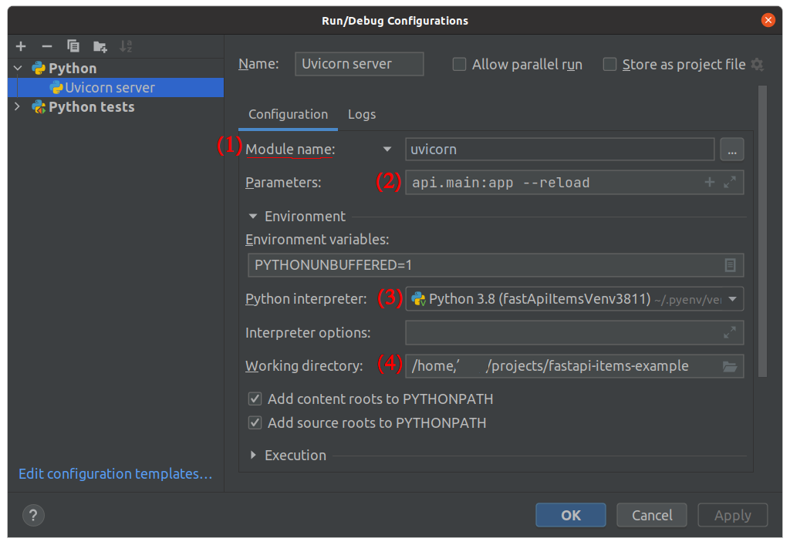

## Objectives!
* CRUD
* Dockerize

## Entry Points!
* http://127.0.0.1:80/docs
* http://127.0.0.1:80/redoc

## Prerequisites!
Python 3.6+
* Uvicorn
* FastAPI
* SQLAlchemy

*Previously was used PyJWT. But it was updated to use Python-jose instead as it provides all the features from PyJWT plus some extras that you might need later when building integrations with other tools.*

* python-jose[cryptography]

*PassLib is a great Python package to handle password hashes.
With passlib, you could even configure it to be able to read passwords created by Django, a Flask security plug-in or many others.*
* passlib[bcrypt]
* SqlLite
```shell
pip install uvicorn[standard] fastapi[all] python-jose[cryptography] passlib[bcrypt] pytest
```


## Run server via Shell
```shell
uvicorn api.main:app --reload
```
### Create a virtual environment
```bash
python -m venv env
source ./env/bin/activate
```

### Setup env variables
create a file `.env` similar to `.env.example` via command
```bash
cp .env.dev_example .env
```
then update the file `.env`

## Run server via Docker
```shell
# build image
sudo docker build -t fastapi-api-example .

# run container
sudo docker run -d --name fastapi-api-example -p 80:80 fastapi-api-example

```

## Run server via PyCharm
1) Create virtual environments
2) Add Configurations



configuration file: [.run/UvicornServer.run.xml](.run/UvicornServer.run.xml)

## CI: Docker Build Image
[build-publish-image.yml](./.github/workflows/build-publish-image.yml)

### Pull Image
```shell
docker pull ghcr.io/mtdor/fastapi-api-example:latest
# run container
docker run -d --name fastapi-api-example -p 80:80 ghcr.io/mtdor/fastapi-api-example
```


Inspired by: https://fastapi.tiangolo.com/